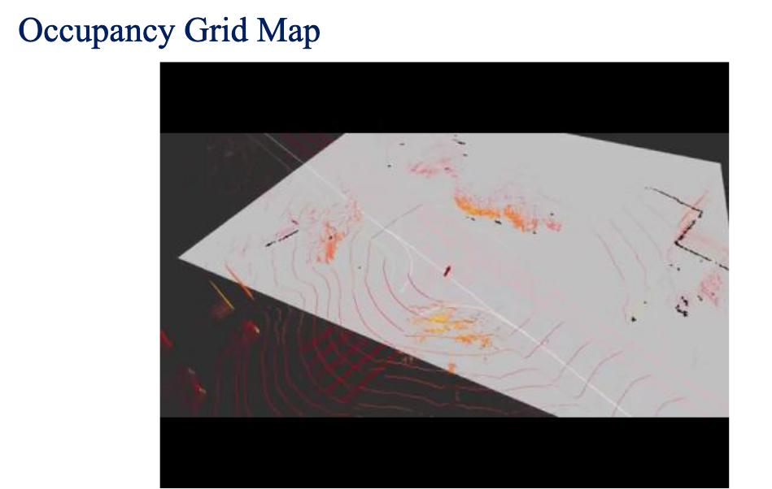
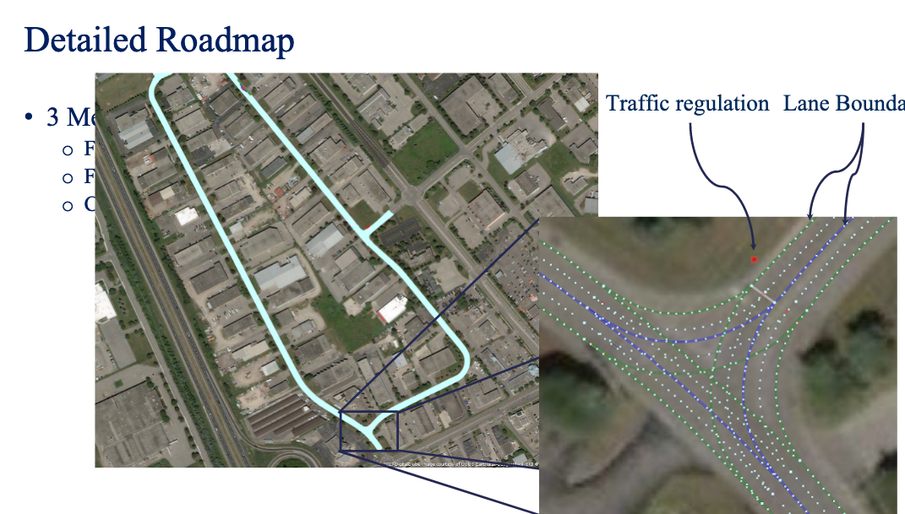

# Module2：Lesson 4: Environment Representation
## Environmental Map Types
In this lesson we'll take a closer
look at the maps created to represent the environment around our car. I'll present an overview of the three
different map types traditionally used for autonomous driving, which you saw
briefly in the previous video. Then I'll give you a more detailed
explanation about each of the maps so you can better understand How they're created
and used throughout the specialization. 
> * Localization Map
 >> * Localization point cloud or Feature Map

 The first map we will discuss
is the localization map. This map is created using
a continuous set of lidar points or camera image features as the car
moves through the enviromment. This map is then used in
combination with GPS, IMU and wheel odometry by the localization module To accurately estimate the precise
location of the vehicle at all times. 

>* Collision Avoidance with Static Objects.
>>* Occupancy Grid Map

The second map is the occupancy grid map. The occupancy grid also uses a continuous
set of LIDAR points to build a map of the environment which indicates
the location of all static, or stationary, obstacles. This map is used to plan safe,
collision-free paths for the autonomous vehicle. 

>* Path planning
>>* Detailed Road Map

The third and final map that we'll discuss
in this video is the detailed road map. It contains detailed positions for all regulatory elements,
regulatory attributes and lane markings. This map is used to plan a path from the
current position to the final destination. 

### localization map

Let's take a closer look
at the localization map. As I mentioned previously, the localization map uses
recorded LIDAR points or images, which are combined to make a point
cloud representation of the environment. As new LIDAR camera data is received it
is compared to the localization map and a measurement of the eagle vehicles
position is created by aligning the new data with the existing map.

 This measurement is then combined with
other sensors to estimate eagle motion and ultimately used to control the vehicle Here we have some recorded LIDAR
data from our self-driving car. The movement of the vehicle is clear based
on the evolution of the LIDAR points in this video. As the car drives out of a driveway and
onto the street ahead. This detailed evolving representation
of the motion of a car through its environment Is extremely valuable for
the localization module. 

The localization map can be quite large,
and many methods exist to compress it's contents and keep only those features
that are needed for localization. The construction of this map will
be more rigorously explained in the next course of this specialization. Where we discuss localization in detail. 

### Occupancy grid 

The occupancy grid is a 2D or 3D
discretized map of the static objects in the environments surrounding
the eagle vehicle. This map is created to identify all
static objects around the autonomous car, once again,
using point clouds as our input. 

The objects which are classified as
static include trees, buildings, curbs, and
all other nondriveable surfaces. For example, in this grid map,
if all occupied grids were colored in, this is what the occupancy
grid may look like. As the occupancy grid only represents
the static objects from the environment, all dynamic objects must first be removed. This is done by removing all lidar points
that are found within the bounding boxes of detected dynamic objects
identified by the perception stack. Next, static objects
which will not interfere with the vehicle are also removed. Such as dryable service or
any over hanging tree branches. As result of these steps only the relevent
writer points from static objects from the environment remain. The filtering process is not perfect and
so it is not possible to blindly trust
the remaining points are in fact obstacles The occupancy grid, therefore, represents
the environment probabilistically, by tracking the likelihood that
a grid cells occupy over time. This map is then relied on to create paths
for the vehicle which are collusion-free. Both the creation of this map and
its application to the local planning problem will
be covered in much greater detail. In course four of the specialization. Let's look at an example of
an occupancy grid updating over time. 

Here, we see the occupancy grid
visualized as the light gray square area, under the autonomous car. Updating the position of static objects
in the environment with black squares. As the autonomous car moves
through the environment, all stationary objects in the environment
such as poles, buildings, and parked cars,
are shown as occupied grid cells. 

##  Detailed Roadmap
Finally, the detailed roadmap is
a map of the full road network which can be driven by
the self-driving car. 

This map contains information
regarding the lanes of a road, as well as any traffic regulation
elements which may affect them. The detailed road map is
used to plan a safe and efficient path to be taken
by the self-driving car. The detailed road map can be
created in one of three ways. Fully online, fully offline, or created offline and updated online. A map which is created fully online relies
heavily on the static object proportion of the perception stack
to accurately label and correctly localize all relevant
static objects to create the map. This includes all lane boundaries
in the current driving environment, any regulation elements,
such as traffic lights or traffic signs, any regulation attributes of the lanes,
such as right turn markings or crosswalks. This method of map creation is rarely used due to the complexity of
creating such a map in real time. A map which is created entirely offline
is usually done by collecting data of a given road several times. Specialized vehicles with high accuracy
sensors are driven along roadways regularly to construct offline maps. Once the collection is complete, the
information is then labelled with the use of a mixture of automatic labelling
from static object perception and human annotation and correction. This method of map creation,
while producing very detailed and accurate maps, is unable to react or
adapt to a changing environment. The third method of creating detailed
roadmaps is to create them offline and then update them online with new,
relevant information. This method of map creation
takes advantage of both methods, creating a highly accurate roadmap
which can be updated while driving. In course four on motion planning, we
will present a method for storing all of the information present in a detailed
roadmap called the lane length model. Let's look at an example
of a detailed roadmap. As you can see, the lane boundaries of
the detailed roadmap are visualized in red Along with the boundaries, the center
of each lane is also visualized in red. This information is vitally important for path-following as it provides
a default path along the lane. As you can see in this video the vehicle, while autonomously driving,
neatly follows the center of the lane. That completes our discussion of
mapping for self-driving cars. In this video, you learned about three
types of maps commonly used for autonomous driving: The localization map, the
occupancy grid, and the detailed road map. You'll study each of these map types
further as we dive into localization, collision avoidance, and motion planning In the remaining
courses of the specialization. Congratulations, you
completed the second module in this introduction to
self-driving cars course. In this module,
you learned how to select sensing and computing hardware in self-driving car, how to design specific sensors [INAUDIBLE]
based on the requirements of driving. How to decompose the software system for
autonomous driving. And what the three main types of maps
are that represent the environment. In the next module, we will take a closer
look at the vehicle modeling for the purpose of precision control. I'll see you in the next module.