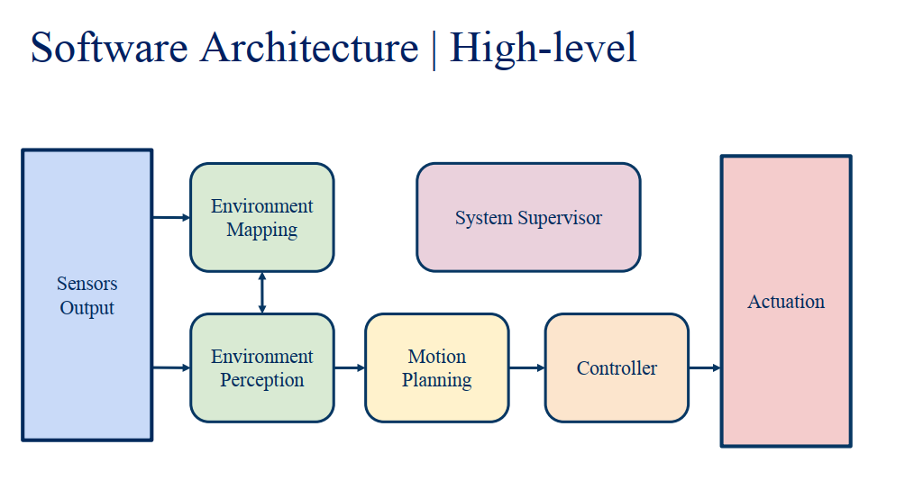
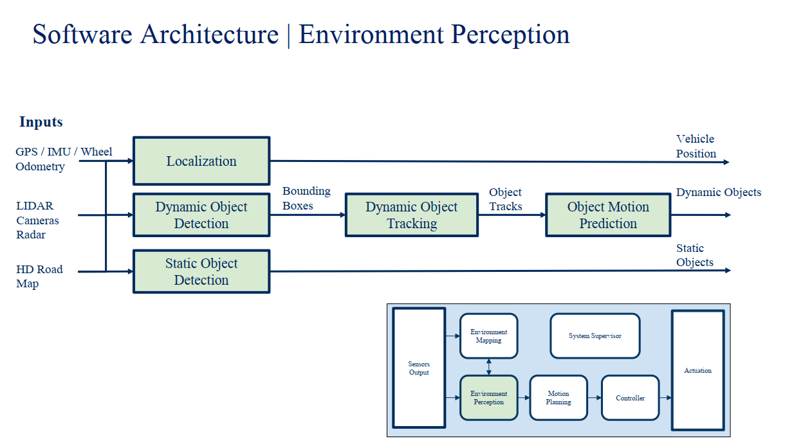
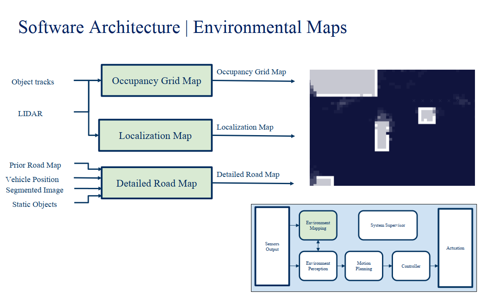
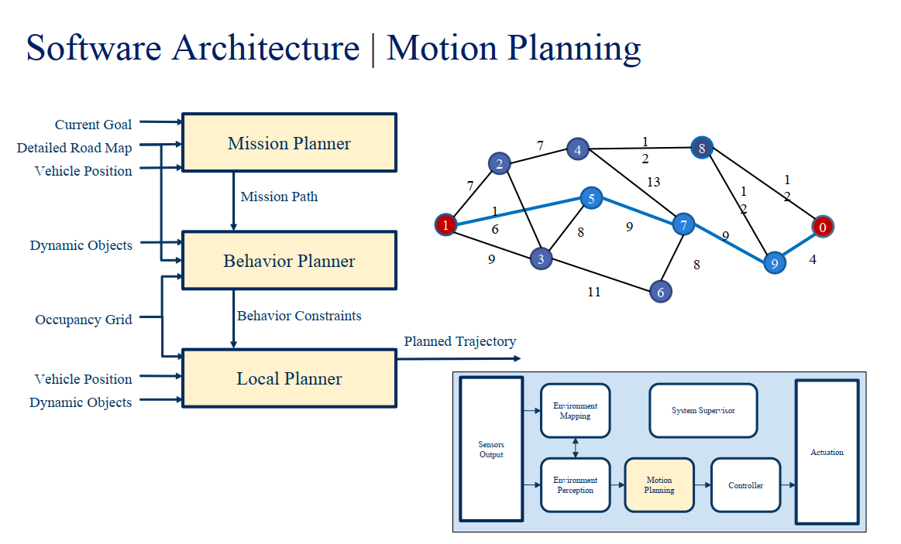
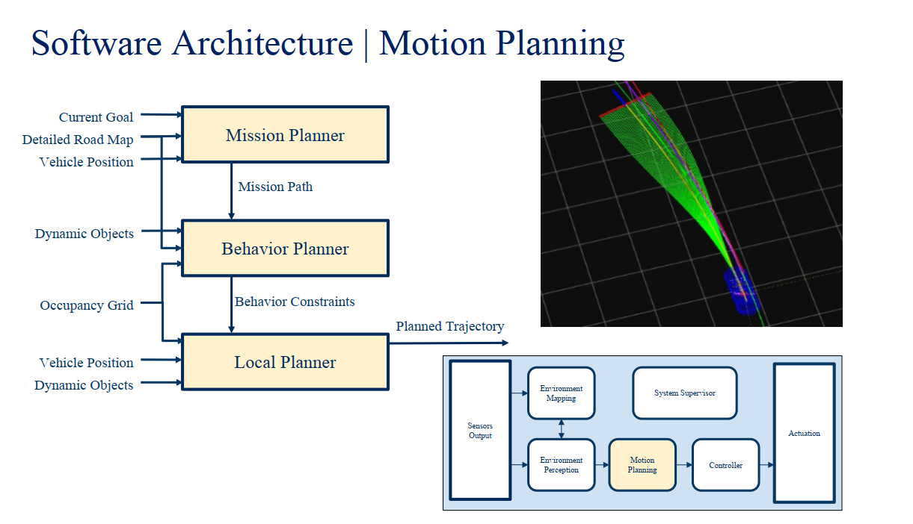
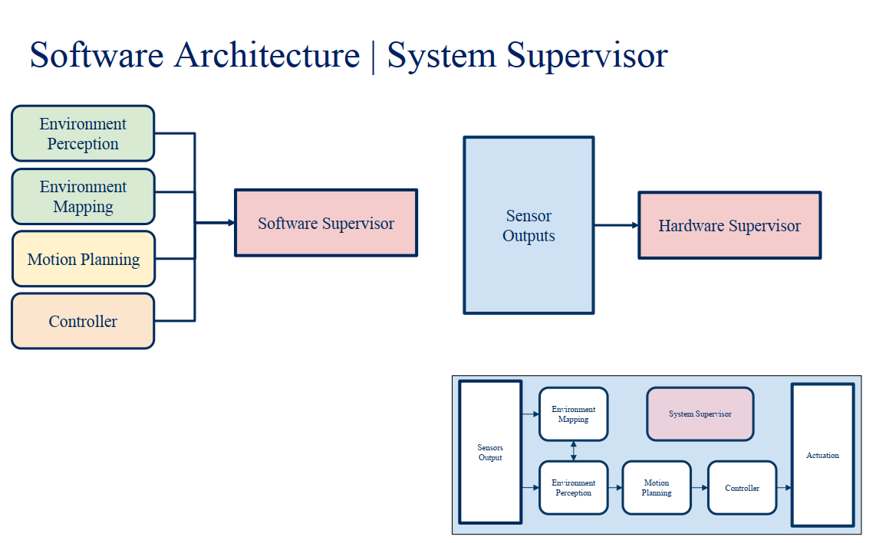

# Module2：Software Architectures
> In the previous videos, we discussed sensors, computing hardware, and
hardware configurations for autonomous vehicles.

### Learning Objectives
* Describe the basic architecture of a typical self-driving
software system
* Identify the standard software decomposition

In this video we will learn about a representative modular
software architecture for self driving cars.
The architecture will use the information provided by the hardware components and
allow us to achieve our goal of autonomous driving.
Let's go over a detailed decomposition of each module of the software stack.
This will allow us to discuss each segment more carefully by taking
a look at the inputs which they receive,
the computations they need to make, and the outputs that they provide.
We will discuss the following five software modules,
environment perception, environment mapping, motion planning,
vehicle control, and finally the system supervisor.
>* environment perception
>* environment mapping
>* motion planning
>*  vehicle control
>*  system supervisor

While this overview of the software stack will not provide implementation detail,
it should give you a good understanding of all of the software components required to
make a self driving car function.
The entire specialization is organized around this structure so
we'll return to it regularly.
Also note this is not the only software architecture used in autonomous driving,
but is a good representation of the necessary functions for
full vehicle autonomy.

## Lession 3: Software Architecture | High-level

Let's take a look at the high level software architecture for
a self driving car's software stack.
As discussed in a previous video,
the car observes the environment around it, using a variety of sensors.

The raw sensor measurements are passed into two sets of modules dedicated
to understanding the environment around the car.
The environment perception modules have two key responsibilities, first,
identifying the current location of the autonomous vehicle in space,
and second, classifying and
locating important elements of the environment for the driving task.
Examples of these elements include other cars, bikes, pedestrians, the road,
road markings, and road signs, anything that directly affects the act of driving.

The environment mapping module creates a set of maps which locate objects in
the environment around the autonomous vehicle for a range of different uses,
from collision avoidance to ego motion tracking and motion planning.

The third module is known as motion planning.
The motion planning module makes all the decisions about what actions to take and
where to drive based on all of the information provided by the perception and
mapping modules.

The motion planning module's main output is a safe, efficient and
comfortable planned path that moves the vehicle towards its goal.
The planned path is then executed by the fourth module, the controller.

The controller module takes the path and decides on the best steering angle,
throttle position, brake pedal position, and
gear settings to precisely follow the planned path.

The fifth and final module is the system supervisor.
The system supervisor monitors all parts of the software stack, as well as
the hardware output, to make sure that all systems are working as intended.
The system supervisor is also responsible for
informing the safety driver of any problems found in the system.

### 1. Software Architecture | Environment Perception

Now that we have a general idea of the function of the main modules,
let's take a closer look at each module individually. First, let's start with environment perception.

**Environment perception:**
As discussed previously, there are two important parts of the perception stack,
localizing the ego-vehicle in space, as well as classifying and
locating the important elements of the environment.
The localization module takes in multiple streams of information,
such as the current GPS location, IMU measurements and wheel odometry.

It then combines them to output an accurate vehicle location.
For greater accuracy,
some localization modules also incorporate LIDAR and camera data.
This localization problem will be discussed in much greater
detail in the next course of this specialization on state estimation.

Typically, the problem of classification and
localization of the environmental elements is divided into two segments,
first, detecting dynamic objects in the environment, and second,
detecting the static objects in the environment.
The dynamic object detection module uses a set of camera inputs as well as
LIDAR point clouds to create 3D bounding boxes around dynamic objects in the scene.
The 3D bounding boxes encode the class or type of object as well
as the exact position, orientation and size of the object.
Once detected, the dynamic objects are tracked over time by a tracking module.
The tracker module provides not only the current position of the dynamic objects
but also the history of its path through the environment.
The history of the path is used along with the roadmaps In order
to predict the future path of all dynamic objects.
This is usually handled by a prediction module,
which combines all information regarding the dynamic object and
the current environment to predict the path of all dynamic objects.
The static object detection module also relies on a combination of camera
input and LIDAR data to identify significant static objects in the scene.
Such important data include the current lane in which the self-driving vehicle is
found, and the location of regulatory elements such as signs and traffic lights.
The problem of environment perception will be the focus of course three in this
specialization on visual perception.

**Environment Mapping Modules:**
Now that we have a better idea of how the perception stack works,
let's move on to the environment mapping modules.
Environment maps create several different types of representation of
the current environment around the autonomous car.
There are three types of maps that we discuss briefly, the occupancy grid map,
the localization map and the detailed road map.

The occupancy grid is a map of all static objects in the environment
surrounding the vehicle.
LIDAR is predominantly used to construct the occupancy grid map.

A set of filters are first applied to the LIDAR data to make it usable by
the occupancy grid.
For example, the drivable surface points and dynamic object points are removed.
The occupancy grid map represents the environment as a set of grid cells and
associates a probability that each cell is occupied.
This allows us to handle uncertainty in the measurement data and
improve the map over time.
The localization map, which is constructed from LIDAR, or camera data,
is used by the localization module in order to improve eco state estimation.
Sensor data is compared to this map while driving to determine
the motion of the car relative to the localization map.
This motion is then combined with other proprioceptor sensor
information to accurately localize the eco vehicle.
The detailed road map provides a map of road segments which represent the driving
environment that the autonomous vehicle is currently driving through.
It captures signs and lane markings in a manner that can be used for
motion planning.

This map is traditionally a combination of prerecorded data as well as
incoming information from the current static environment gathered
by the perception stack.
The environment mapping and perception modules
interact significantly to improve the performance of both modules.
For example, the perception module provides the static environment
information needed to update the detailed road map, which is then used by
the prediction module to create more accurate dynamic object predictions.
***Motion Planning Module** 
Next, we'll take a closer look at how the output from both the environment maps and
the perception modules are combined and
used by the motion planning module to create a path through the environment.
Motion planning for self-driving cars is a challenging task, and
it's hard to solve in a single integrated process.
Instead, most self-driving cars today use a decomposition that divides
the problem into several layers of abstraction as follows.
At the top level, the mission planner handles long term planning and
defines the mission over the entire horizon of the driving task,
from the current location, through the road network to its final destination.

To find the complete mission, the mission planner determines the optimal
sequence of road segments that connect your origin and destination, and
then passes this to the next layer.

The behavior planner is the next level of abstraction,
solving short term planning problems.
The behaviour planner is responsible for establishing a set of safe actions or
maneuvers to be executed while travelling along the mission path.
An example of the behaviour planner decisions would be whether the vehicle
should merge into an adjacent lane given the desired speed and
the predicted behaviors of nearby vehicles.
Along with the maneuver of decisions,
the behavior planner also provides a set of constrains to execute with each action,
such as how long to remain in the current lane before switching.

Finally, the local planner performs immediate or reactive planning, and
is responsible for defining a specific path and velocity profile to drive.
The local plan must be smooth, safe, and efficient given all
the current constraints imposed by the environment and maneuver.
In order to create such a plan, the local planner
combines information provided by the behavior planner, occupancy grid,
the vehicle operating limits, and other dynamic objects in the environment.
The output of the local planner is a planned trajectory which is a combined
desired path and velocity profile for a short period of time into the future.
The fourth course of this specialization is dedicated to motion planning.
Next, let's see how a typical vehicle controller takes the given trajectory and
turns it into a set of precise actuation commands for the vehicle to apply.
A typical controller separates the control problem into a longitudinal control and
a lateral control.
The lateral controller outputs the steering angle required to maintain
the planned trajectory, whereas the longitudinal controller regulates
the throttle, gears and braking system to achieve the correct velocity.
Both controllers calculate current errors and
tracking performance of the local plan, and
adjust the current actuation commands to minimize the errors going forward.
We'll dig into vehicle control later in this course.
Finally, let's take a closer look at the system supervisor and its functions.

The system supervisor is the module that continuously monitors all aspects of
the autonomous car and
gives the appropriate warning in the event of a subsystem failure.
There are two parts, the hardware supervisor, and the software supervisor.
The hardware supervisor continuously monitors all hardware components to
check for any faults, such as a broken sensor, a missing measurement, or
degraded information.
Another responsibility of the hardware supervisor is to continuously
analyze the hardware outputs for any outputs which do not match the domain
which the self-driving car was programmed to perform under.
For example, if one of the camera sensors is blocked by a paper bag or
if snow is falling and corrupting the LIDAR point cloud data.
The software supervisor has the responsibility of validating this software
stack to make sure that all elements are running as intended
at the right frequencies and providing complete outputs.
The software supervisor also is responsible for
analyzing inconsistencies between the outputs of all modules.
In this video, we looked at the basic software architecture of a typical
self-driving software system.
In fact, we looked at the decomposition of five major modules and
their responsibilities.
These included: environment perception, environment mapping,
motion planning, vehicle controller and, finally, the system supervisor.
In the next video, we'll take a closer look at environment mapping.
We'll look at the three maps used throughout the software architecture,
the occupancy grid, the localization map, and the detailed road map.
See you in the next video